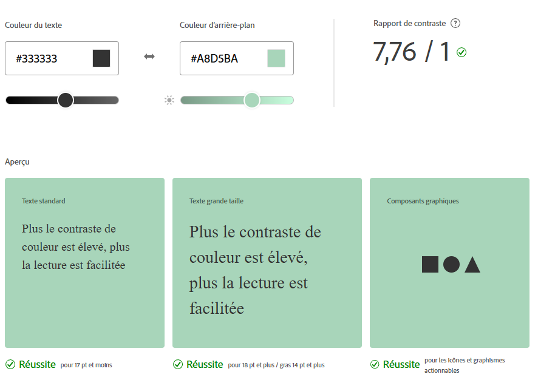

# 📅 Agenda Intelligent – Zen & Organisé

**Agenda Intelligent** est une application web et mobile qui aide les utilisateurs à planifier leurs activités (ponctuelles ou récurrentes) en prenant en compte le lieu, le temps de trajet, la préparation nécessaire, et en envoyant automatiquement des rappels. L’objectif : **réduire la charge mentale**, améliorer l’organisation et favoriser un quotidien plus fluide.

---

## 🚀 Fonctionnalités principales

- Création d’événements ponctuels ou récurrents
- Sélection du lieu via intégration Google Maps
- Calcul automatique du temps de trajet
- Ajout de tâches (todo) liées à l’événement
- Estimation de la durée de préparation
- Notification automatique à l’heure optimale (préparation + trajet)
- Vue agenda intuitive et claire

---

## ➕ Fonctionnalités secondaires

- Gestion d’événements récurrents (ex : tous les lundis)
- Liste todo par événement
- Historique de notifications
- Interface responsive (web & mobile)
- Synchronisation possible avec un agenda externe (Google Calendar, à venir)

---

## 🎯 Public cible

- Parents organisant des activités pour leurs enfants
- Personnes actives souhaitant optimiser leur temps
- Étudiants ou professionnels à la recherche de structure
- Utilisateurs ayant besoin de rappels logiques et pratiques

---

## 🧱 Stack technique

| Composant                    | Technologie  |
| ---------------------------- | ------------ |
| **Frontend mobile**          | React Native |
| **Frontend web (optionnel)** | React.js     |
| **Backend**                  | Node.js      |
| **Base de données**          | PostgreSQL   |

---

## 🎨 Design UI / UX

Lien derniere [mise à jour de la maquette](https://www.figma.com/proto/5b2geFJSYFLRaoYn3beTqf/Untitled?node-id=10-1362&p=f&t=xavBCwQfP3gzneop-1&scaling=scale-down&content-scaling=fixed&page-id=1%3A2&starting-point-node-id=10%3A1362)

Cette maquette présente une interface intuitive permettant aux utilisateurs de créer et gérer facilement leurs tâches et sous-tâches préparatoires à différents événements du quotidien.

### 🎯 Objectifs UX

- Simplifier l’ajout et la modification d’événements

- Gérer les tâches préparatoires en quelques clics

- Faciliter la réutilisation des préparatifs existants via la recherche et l’autocomplétion

- Offrir une expérience fluide sur mobile

### 🌈 Univers Visuel

**Ambiance :**
Zen, minimaliste, moderne et propice à la concentration.

**Palette de couleurs :**

- Vert sauge #A8D5BA
- Bleu pastel #B3CDE0
- Pêche clair #FFDAB9
- Blanc cassé #FAFAFA
- Gris foncé #333333

**Typographie :**

- Titres : Raleway
- Textes : DM Sans

Éléments graphiques :

- Boutons arrondis
- Icônes minimalistes

Légers effets d’ombre pour une interface douce et structurée

#### ♿ **Accessibilité**

- Contrastes optimisés pour les personnes malvoyantes
- Hiérarchie claire des contenus
- Interfaces testées via [Adobe Color](https://color.adobe.com/fr/create/color-contrast-analyzer)  
  

✨ Résumé
Agenda Intelligent combine organisation, clarté et praticité. L'application se distingue par sa capacité à anticiper les besoins liés aux événements (préparation, trajet, rappels intelligents), tout en offrant une interface moderne et apaisante.
Une solution idéale pour toute personne souhaitant alléger son quotidien et mieux gérer son temps.

🛠️ Prochaine étape : Intégration avec des outils tiers (Google Calendar, Siri, Alexa...) et ajout de widgets personnalisables.
